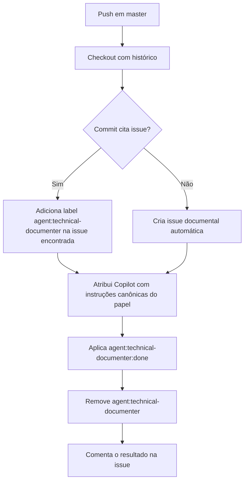

# Workflow técnico: `technical-documenter.yml`

## Objetivo

Documentar a automação criada no commit `7c731ac9509c01ebaa8aef055295250f7011f04e` para garantir que pushes em `master` sem issue fonte ainda gerem trilha documental no GitHub.

## Escopo

- repositório: `ControleOnline/api-whatsapp`
- workflow: `.github/workflows/technical-documenter.yml`
- branch monitorada: `master`
- papel acionado: `technical-documenter`

## Quando executa

O workflow roda a cada `push` em `master`.

## Fluxo resumido

## Etapas operacionais

### 1. Detectar issue fonte

O job lê as mensagens de commit entre `github.event.before` e `github.sha` e procura a primeira referência no formato:

- `#123`
- `owner/repo#123`

Se encontrar, reaproveita o número da issue. Se não encontrar, segue para criação de uma issue documental automática.

### 2. Criar ou preparar issue

O workflow usa `gh` com `GH_TOKEN` para:

- adicionar `agent:technical-documenter` em uma issue já referenciada; ou
- criar uma nova issue com título `docs: documentação técnica automática (push master <sha>)`.

Em ambos os casos, a issue recebe:

- atribuição para `copilot-swe-agent[bot]`
- `agent_assignment` com `target_repo`, `base_branch=master` e instruções canônicas do papel `technical-documenter`

### 3. Finalizar labels e comentário

Ao final, o job:

- adiciona `agent:technical-documenter:done`
- remove `agent:technical-documenter`
- registra um comentário curto na issue

Quando a issue foi criada automaticamente, o workflow também adiciona:

- `qa:accepted`
- `security:accepted`

## Contrato de labels

| Label | Papel no fluxo |
| --- | --- |
| `agent:technical-documenter` | sinaliza que a issue precisa de documentação técnica |
| `agent:technical-documenter:done` | marca a conclusão documental |
| `qa:accepted` | aplicado automaticamente apenas quando a issue nasce do próprio workflow |
| `security:accepted` | aplicado automaticamente apenas quando a issue nasce do próprio workflow |

## Dependências e permissões

Permissões declaradas:

- `contents: read`
- `issues: write`
- `pull-requests: write`

Dependências operacionais:

- GitHub CLI `gh`
- `jq` para serializar `custom_instructions`
- histórico Git suficiente para ler os commits do push

## Limites e cuidados operacionais

- O workflow não publica conteúdo de wiki por conta própria; ele apenas prepara a trilha GitHub para o papel `technical-documenter`.
- A automação depende do secret `GH_TOKEN`.
- A detecção usa a primeira referência de issue encontrada nas mensagens do push.
- O fluxo deve evitar expor segredos: a issue criada contém SHA, mensagem de commit e instruções do papel, mas não deve incluir credenciais nem payloads sensíveis.

## O que este módulo faz e o que não faz

### Faz

- cria rastreabilidade documental para pushes em `master`
- garante atribuição do papel documental ao Copilot
- aplica labels finais de documentação

### Não faz

- não altera rotas, payloads ou contratos da API WhatsApp
- não substitui a wiki como fonte primária
- não executa QA funcional nem revisão de segurança de código
- não depende de sessão ativa do WhatsApp nem impacta `/health`

## Artefatos relacionados

- workflow: [`/.github/workflows/technical-documenter.yml`](../../.github/workflows/technical-documenter.yml)
- checks básicos: [`/.github/workflows/pull-request-checks.yml`](../../.github/workflows/pull-request-checks.yml)
- ponte local de navegação: [`/AGENTS.md`](../../AGENTS.md)
