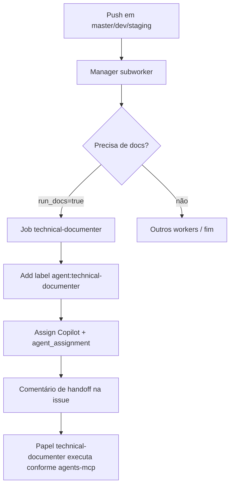

# Workflow técnico: documentação automática via Manager Worker

## Objetivo

Documentar a automação que garante trilha documental no GitHub quando há push em branches monitoradas, sem depender de issue fonte explícita no commit. A orquestração atual é o **Manager Worker**; o papel `technical-documenter` é invocado como subworker.

## Escopo

- repositório: `ControleOnline/api-whatsapp`
- workflow orquestrador: `.github/workflows/manager-worker.yml`
- composite action: `.github/actions/workers/technical-documenter`
- branches monitoradas: `master`, `dev`, `staging`
- papel acionado: `technical-documenter` (fonte canônica em `agents-mcp`)

## Histórico

- Commit `7c731ac`: introduziu workflow legítimo `technical-documenter.yml` (push em `master`).
- Commit `85a61e9`: removeu o workflow legado; substituído pelo orquestrador `manager-worker.yml` + subworkers (manager, qa, security, technical-documenter).

A documentação abaixo descreve o **contrato operacional atual**.

## Quando executa

O workflow `manager-worker` roda a cada `push` em `master`, `dev` ou `staging`.

O job `manager` resolve/cria issue e define o plano de workers (`run_docs`, `run_qa`, `run_security`, etc.).

O job `technical-documenter` só roda quando `needs.manager.outputs.run_docs == 'true'`.

## Fluxo resumido



## Etapas operacionais

### 1. Manager resolve issue e plano

O composite `./.github/actions/workers/manager`:

- detecta referências de issue nas mensagens de commit (ou cria issue documental quando ausente);
- emite outputs: `issue_number`, `run_docs`, `run_qa`, `run_security`, `base_branch`, etc.

### 2. Subworker technical-documenter

Quando `run_docs=true`, o job:

1. adiciona label `agent:technical-documenter` na issue;
2. atribui `copilot-swe-agent[bot]` com `agent_assignment` (target_repo, base_branch, custom_instructions apontando 100% para a fonte canônica em agents-mcp);
3. comenta o handoff na issue.

**Regras de conteúdo e labels de conclusão (`agent:technical-documenter:done`) vivem exclusivamente em:**

- `https://raw.githubusercontent.com/ControleOnline/agents-mcp/master/agents/roles/technical-documenter/agent.md`
- skills referenciadas pelo papel

O composite **não** embute checklist de documentação; apenas prepara o assignment.

### 3. Conclusão do papel

O agent `technical-documenter` (sessão ou Copilot) aplica a documentação (wiki-first + espelho versionado quando cabível) e fecha o ciclo com `agent:technical-documenter:done` conforme a fonte canônica.

## Contrato de labels (orquestração)

| Label | Papel no fluxo |
| --- | --- |
| `agent:technical-documenter` | sinaliza que a issue precisa de documentação técnica (aplicada pelo subworker) |
| `agent:technical-documenter:done` | conclusão documental (aplicada pelo papel, não pelo composite) |

Labels `qa:accepted` / `security:accepted` automáticas no fluxo legado **não** são aplicadas pelo subworker atual; gates de QA/Security seguem os jobs dedicados e as labels dos agents de revisão.

## Dependências e permissões

Workflow `manager-worker.yml`:

```yaml
permissions:
  contents: read
  issues: write
  pull-requests: write
```

Requer secret `GH_TOKEN` (ou equivalente) com escopo para issues/assignees.

## Limites operacionais

- O composite só prepara labels + assignment; não gera conteúdo de wiki nem aplica `:done`.
- Fonte de verdade do papel: **agents-mcp** (não duplicar regras no repositório de produto).
- Wiki do módulo permanece fonte primária de leitura humana; `docs/technical/` é espelho versionado / fallback.

## Referências

- Workflow: `.github/workflows/manager-worker.yml`
- Action: `.github/actions/workers/technical-documenter/action.yml`
- Papel canônico: [technical-documenter/agent.md](https://github.com/ControleOnline/agents-mcp/blob/master/agents/roles/technical-documenter/agent.md)
- Issue documental original (legado): #31
- PR de espelho (conteúdo base, base desatualizada): #32
